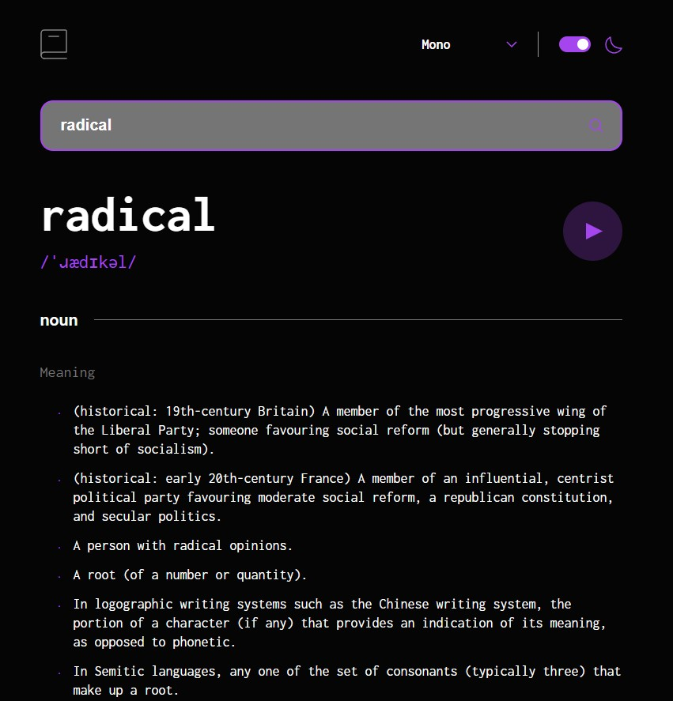

# Frontend Mentor - Dictionary web app solution

This is a solution to the [Dictionary web app challenge on Frontend Mentor](https://www.frontendmentor.io/challenges/dictionary-web-app-h5wwnyuKFL). Frontend Mentor challenges help you improve your coding skills by building realistic projects.

## Table of contents

- [Overview](#overview)
  - [The challenge](#the-challenge)
  - [Screenshot](#screenshot)
  - [Links](#links)
- [My process](#my-process)
  - [Built with](#built-with)
  - [What I learned](#what-i-learned)
- [Author](#author)

**Note: Delete this note and update the table of contents based on what sections you keep.**

## Overview

### The challenge

Users should be able to:

- Search for words using the input field
- See the Free Dictionary API's response for the searched word
- See a form validation message when trying to submit a blank form
- Play the audio file for a word when it's available
- Switch between serif, sans serif, and monospace fonts
- Switch between light and dark themes
- View the optimal layout for the interface depending on their device's screen size
- See hover and focus states for all interactive elements on the page
- **Bonus**: Have the correct color scheme chosen for them based on their computer preferences. _Hint_: Research `prefers-color-scheme` in CSS.

### Screenshot

### Links

- Solution URL: (https://github.com/animalchin45/dictionary)
- Live Site URL: (https://dictionary-bice.vercel.app/)

## My process

### Built with

- Semantic HTML5 markup
- SASS / CSS
- CSS Grid
- Mobile-first workflow
- [React](https://reactjs.org/) - JS library
- Custom React Hooks
- Webpack
- Axios

### What I learned

This project was my first attempt at theme switching. Organization is key when making an app that changes between lite and dark themes as well as font changes. Thank you for taking a look at my solution and feel free to comment with any feedback.

## Author

- Website - [Tim O'Brien](https://timobrien.dev)
- Frontend Mentor - [@animalchin45](https://www.frontendmentor.io/profile/animalchin45)
